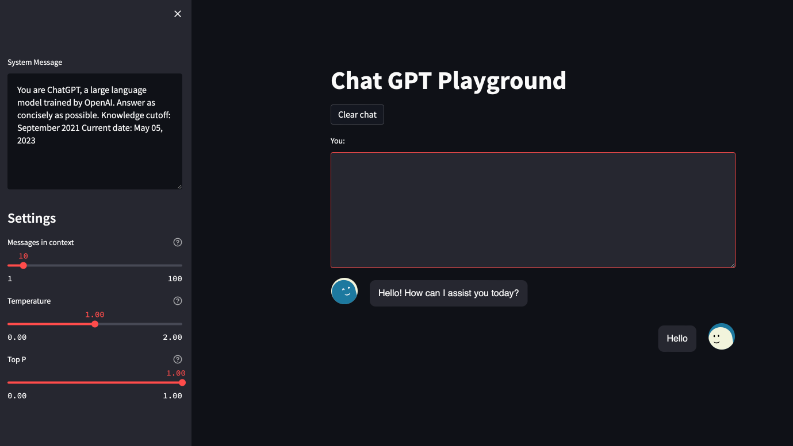

# ChatGPT Playground

This is a copy of the chat gpt playground. But you can define a login password, the API endpoint and the API key in the secrets.
This is useful to provide the playground to people in workshops.

# Getting started

Install dependencies:

    pip install -r requirements.txt

Set your OpenAI api key in the `.streamlit./secrets.toml` file

    cp ./.streamlit./secrets_example.toml ./.streamlit./secrets.toml

Run the streamlit app locally

    streamlit run app.py

The default password is `password`.

# Contributing

Python >= 3.11

Install additional developer requirements

    pip install -r requirements-dev.py

Install tools that check code style:

    pre-commit install

To run the tests create an `.env` file with your OpenAI api key

    cp .env-example .env

Run the tests. You can enable online tests in the `./tests/test_config.py` file.

    pytest tests
